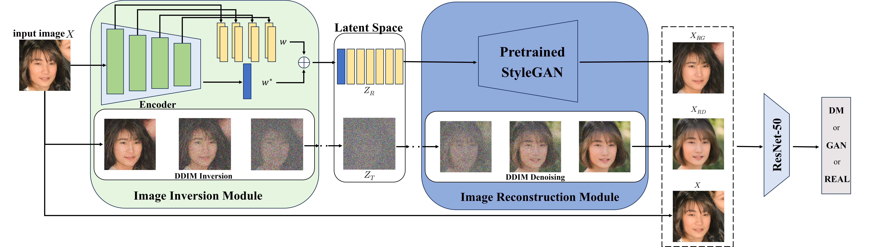
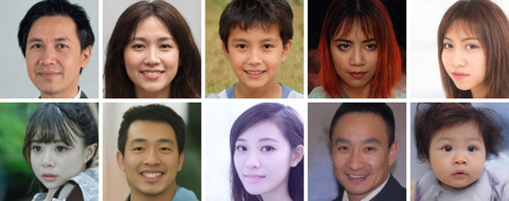

# Model Discrepancy Learning: Synthetic Faces Detection Based on Multi-Reconstruction
Qingchao Jiang, Zhishuo Xu, Zhiying Zhu, Ning Chen, Haoyue Wang, Zhongjie Ba, ICME2025

  <!-- 替换为实际图片路径 -->

## Contributions
Our contributions can be summarized as follows:
- **Multi-Reconstruction-based Detector**:  
  We propose a novel detector to address the challenging task of distinguishing between real, GAN-generated, and DM-generated faces.
- **ASFD Dataset**:  
  We introduce the **Asian Synthetic Face Dataset (ASFD)** to address the under-representation of Asian synthetic face data, providing valuable support for tasks targeting Asian populations.
---

## Asian Synthetic Face Dataset (ASFD)
  <!-- 替换为实际图片路径 -->

- The real dataset used for training was derived from the FFHQ dataset.
- We generated synthetic face images using four classical GAN models and four DM models.
- For GANs, we employed StyleGAN1, StyleGAN2, ProGAN, and VQGAN.
- For DMs, we used ADM, IDDPM, LDM, and SDE.

**Dataset Download**  
- **Preview Subset**: [Download form Google Drive](https://drive.google.com/drive/folders/1bOsTvSYgQJ0Ajuc78y6fdGh4jV80mJB6?usp=drive_link)

**Data Source Declaration**  
Part of this dataset is derived from external resources.  

## Training Pipeline

## 1. Download Weights
Relevant model weights can be obtained from [Google Drive](https://drive.google.com/drive/folders/1ItfajIj7PROaslr4wVmLLC5EkwL9Ju0A?usp=sharing).  
Download and save the weights in the appropriate project directory (if specific weight paths are required, update the configuration files accordingly).

## 2. Generate Reconstructed Images
To obtain images reconstructed using GAN:  
```bash
python ASFD/GAN-recon/scripts/inference.py
```
To obtain images reconstructed using DM:
```bash
python ASFD/DM-recon/guided-diffusion/compute_dire.py
```
## 3. Training Procedure
Place the original image and the two reconstructed images in the following folders by category：
```bash
data/
└── train/
    └── dataset/
        ├── dm/                
        ├── gan/               
        └── real/
```
start training：
```bash
python train.py
```

**Copyright Notice**:  
`# Thanks to dataset provider: Copyright(c) 2018, seeprettyface.com, BUPT_GWY contributes the dataset.`  

## Acknowledgements
This work references data from the following repositories:
- [generators-with-stylegan2](https://github.com/a312863063/generators-with-stylegan2)  <!-- 替换为实际仓库链接 -->
- [DIRE](https://github.com/ZhendongWang6/DIRE)
- [encoder4editing](https://github.com/omertov/encoder4editing)

## Citation

If you find this work useful for your research, please cite our paper:
```bibtex
@inproceedings{jiang2025model,
  title={Model Discrepancy Learning: Synthetic Faces Detection Based on Multi-Reconstruction},
  author={Jiang, QingChao and Xu, ZhiShuo and Zhu, ZhiYing and Chen, Ning and Wang, HaoYue and Ba, ZhongJie},
  booktitle={2025 IEEE International Conference on Multimedia and Expo (ICME)},
  pages={1--6},
  year={2025},
  organization={IEEE}
}
\```
