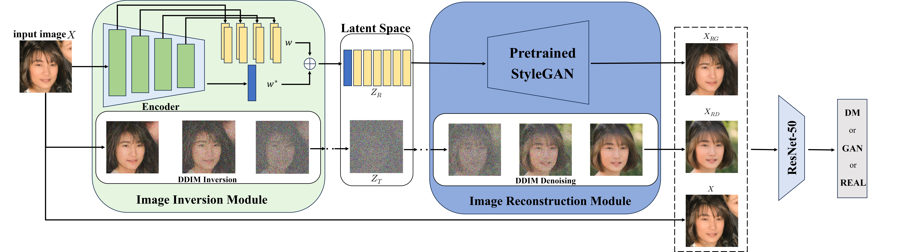
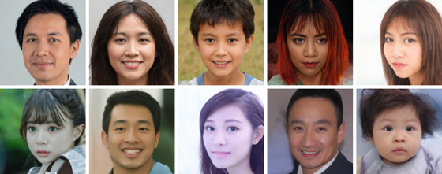

# Model Discrepancy Learning: Synthetic Faces Detection Based on Multi-Reconstruction

  <!-- 替换为实际图片路径 -->

## Contributions
Our contributions can be summarized as follows:
- **Multi-Reconstruction-based Detector**:  
  We propose a novel detector to address the challenging task of distinguishing between real, GAN-generated, and DM-generated faces.
- **ASFD Dataset**:  
  We introduce the **Asian Synthetic Face Dataset (ASFD)** to address the under-representation of Asian synthetic face data, providing valuable support for tasks targeting Asian populations.
- **Experimental Results**:  
  Extensive experiments demonstrate that our method significantly improves detection performance and robustness across different generative models.

---

## Asian Synthetic Face Dataset (ASFD)
  <!-- 替换为实际图片路径 -->

- The real dataset used for training was derived from the FFHQ dataset.
- We generated synthetic face images using four classical GAN models and four DM models.
- For GANs, we employed StyleGAN1, StyleGAN2, ProGAN, and VQGAN.
- For DMs, we used ADM, IDDPM, LDM, and SDE.

**Dataset Download**  
- **Preview Subset**: [Download Sample Data](https://your-dataset-link.com/asfd_sample.zip) (可选)

**Data Source Declaration**  
Part of this dataset is derived from external resources.  

**Copyright Notice**:  
`# Thanks to dataset provider: Copyright(c) 2018, seeprettyface.com, BUPT_GWY contributes the dataset.`  

---

## Acknowledgements
This work references data from the following repositories:
- [generators-with-stylegan2](https://github.com/a312863063/generators-with-stylegan2)  <!-- 替换为实际仓库链接 -->
